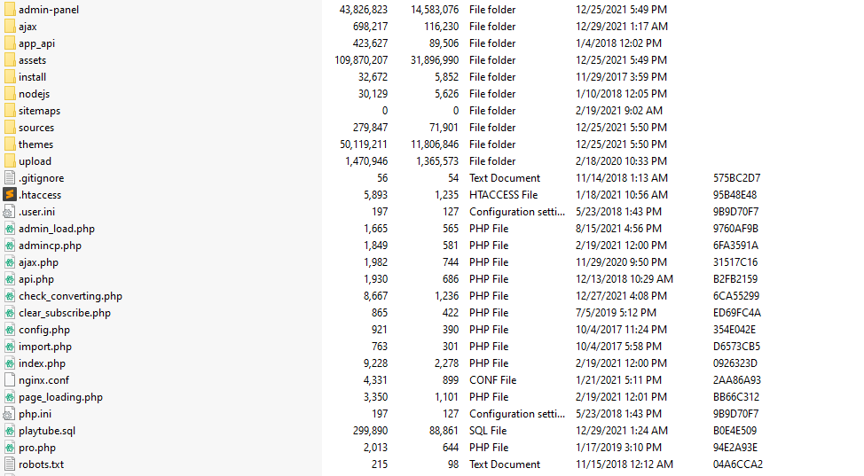
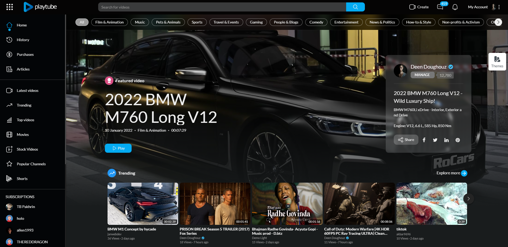
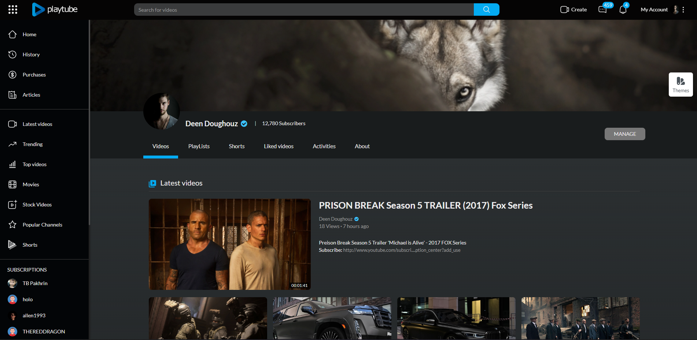
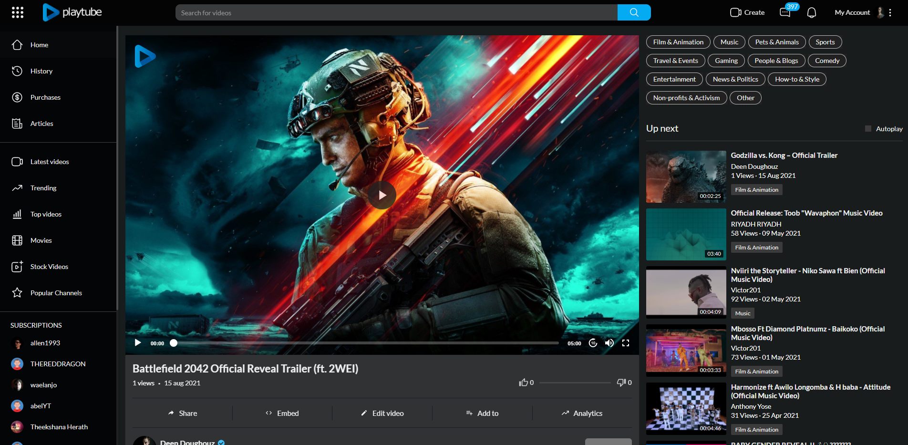

  

## زمانەکان
- [ئینگلیزی](readme.md)
- [فارسی](readme-fa.md)
- [کوردی](readme-kurdish.md)

# PlayTube - یەکەمین پلاتفۆرمی بەشکردنی ڤیدیۆی PHP و ڤیدیۆی بەشکردن

PlayTube سکریپتی بەشکردن و ڤیدیۆی ڕەشەری PHP یە. ئەو باشترین ڕێگایە بۆ دەستپێکردنی ماڵپەڕی بەشکردنی ڤیدیۆی خۆت وەک YouTube! پلاتفۆرمی ئێمە خێرا، سەلامە و بە هەردەم نوێ دەکرێتەوە. PlayTube پشتیوانی تەواوی بەرنامەی مۆبایلی نەتەوەیی دەکات، سوپاسی سیستەمی API پێشکەوتووەکەمان!

## تایبەتمەندییەکان
- بەشکردنی ڤیدیۆ و ڕەشەری ڤیدیۆ
- پشتیوانی بەرنامەی مۆبایلی نەتەوەیی
- نوێکردنەوەی هەردەم
- خێرا و سەلامە

## پێویستییەکان
- PHP 7.1 یان بەرزتر
- MySQLi
- پێوەکراوی PHP یەکەی GD Library
- پێوەکراوی PHP یەکەی mbstring
- پێوەکراوی PHP یەکەی calendar
- فەرمی PHP یەکەی shell_exec
- cURL + allow_url_fopen چالاککراو

## دامەزراندن
پەیڕەوکردنی هەنگاوەکان خوارەوە بۆ دامەزراندنی ماڵپەڕەکەت:

1. پەڕەکەی داگرتوو بکشە و فۆڵدەری `/Script` بکە بۆ دۆزینەوەی هەموو پەڕەکانی سکریپت. پێویستە ئەم پەڕانە بەرز بکەیتە سەر ڕاژەی میزبانی وێبەکەت بە بەکارهێنانی FTP یان localhost بۆ بەکارهێنانی لەسەر ماڵپەڕەکەت.
2. فۆڵدەری خوارەوە پێویستە بەرز بکەیتە سەر ڕەشەری ماڵپەڕەکەت یان localhost:

   

     
   

3. پێویستە هەموو پەڕەکان بەرز بکەیت.
4. کاتێک تەواو کردنی بەرزکردنەوە، وێبگەڕەکەت بیکەرەوە (Google Chrome پێشنیار دەکرێت).
5. بڕۆ بۆ `http://www.YOURSITE.com/install`
6. ڕازیبە بە مەرجەکانی بەکارهێنان پاشان کرتە بکە لەسەر دواتر.
7. گرنگە! پێش ئەوەی دامەزراندن دەستپێبکەین، تکایە دڵنیابە لەوەی ئەم پێویستییەکان لەسەر ڕاژەکەت دامەزرابن:

   

     
   

8. لە لاپەڕەی دووەم، دڵنیابە لە پڕکردنەوەی زانیارییە پێویستەکان:

   

     
   

   - **کۆدی کڕین** - کۆدی کڕینی Envato. ئەمە چییە؟
   - **ناوی ڕاژەی SQL** - ناوی ڕاژەی MySQL، بۆ نموونە: localhost
   - **ناوی بەکارهێنەری SQL** - ناوی بەکارهێنەری MySQL.
   - **تێپەڕەوشەی SQL** - تێپەڕەوشەی بەکارهێنەری MySQL.
   - **بنکەی دراوەی SQL** - ناوی بنکەی دراوەی MySQL.
   - **URL ی ماڵپەڕ** - URL ی ماڵپەڕەکەت، نموونەکان:
     - `https://siteurl.com`
     - `https://www.siteurl.com`
     - `https://siteurl.com`
     - `https://subdomain.siteurl.com`
     - `http://localhost`
     - `https://siteurl.com/subfolder`
   - **ناوی ماڵپەڕ** - ناوی ماڵپەڕەکەت، زۆرترین 32 تیپ.
   - **سەردێڕی ماڵپەڕ** - سەردێڕی ماڵپەڕەکەت، زۆرترین 100 تیپ.
   - **ئیمەیڵی ماڵپەڕ** - ئیمەیڵی ماڵپەڕەکەت، بۆ نموونە: info@yourdomain.com، Gmail یان Hotmail پشتیوانی ناکرێت. پێویستە یەکێک لە ئیمەیڵەکانی ڕاژەکەت بێت.
   - **ناوی بەکارهێنەری بەڕێوەبەر** - ناوی بەکارهێنەری بەڕێوەبەری هەڵبژێرە.
   - **تێپەڕەوشەی بەڕێوەبەر** - تێپەڕەوشەی بەڕێوەبەری هەڵبژێرە.

9. کاتێک زانیاریەکان پڕکردنەوە، تکایە کرتە بکە لەسەر دوگمەی دامەزراندن و چاوەڕوانی بکە بۆ ماوەیەک، پرۆسەی دامەزراندن دەتوانێت تا 5 خولەک بەر بکات.
10. ئێمە ئامادەین بۆ دەستپێکردن!

### بەکارهێنانی Nginx؟
ئەگەر ڕاژەکەت بەکارهێنانی Nginx دەکات، تکایە پەیڕەوکردنی هەنگاوەکان خوارەوە:

1. فایلی بنەڕەتی ڕاژەکەت `nginx.conf` بکەرەوە، زۆربەی کاتەکان لە: `/etc/nginx/nginx.conf` دۆزرایەوە
2. فۆڵدەری ماڵەوەی سکریپت بکەرەوە، پێویستە بتوانیت ئەم پەڕەیە `nginx.conf` بدۆزیتەوە.
3. پەڕەی دۆزرایەوە بکەرەوە، و ناوەڕۆکی بەرز بکە بۆ فایلی بنەڕەتی ڕاژەکەت: `/etc/nginx/nginx.conf`
4. ئەگەر دۆزینەوەی ئەمە قورسە، تکایە پەیوەندی بکە بە میزبانی ڕاژەکەت، و ئەوان بە ئاسانیدا ئەمە بۆ تۆ دەکەن.

### چی دواتر؟
گرنگە! پاش ئەوەی دامەزراندن تەواو بوو، پێویستە کرۆنجۆب دامەزرابێت. تکایە فەرمی خوارەوە بەکاربە و زیاد بکە بۆ کرۆنجۆبی ڕاژەکەت.

1. تێرمینالی لینوکس بکەرەوە یان بە SSH بچۆ ژوورەوە.
2. بەکاربە: `crontab -e`
3. ئەم کۆدە زیاد بکە بۆ لیستەکە: `*/15 * * * * php -f {PATH_TO_SCRIPT_FROM_ROOT}/cronjob.php > /dev/null 2>&1`.
   - `{PATH_TO_SCRIPT_FROM_ROOT}` لەگەڵ ڕێڕەوی تەواوی پەڕەکە بگۆڕە، بۆ نموونە: `/home/playtube/public_html/cronjob.php`
4. پاشەکەوت بکە و دەرچوون.

ئەگەر بەکارهێنانی cPanel دەکەیت، تکایە پەیڕەوکردنی ئەم هەنگاوەکان و ناوی پەڕەیەکە بگۆڕە بە `cronjob.php`، و دڵنیابە لەوەی کرۆنجۆب هەموو 15 خولەک جارێک دەڕوات.

## وەشانی ئێستا
v3.1.1

## وێنەکان
ئەمەندە وێنەی پلاتفۆرمەکە:

  
  
  
  
  

