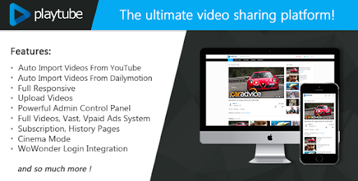
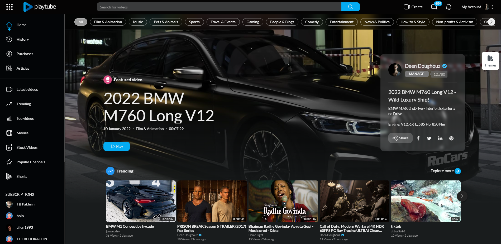
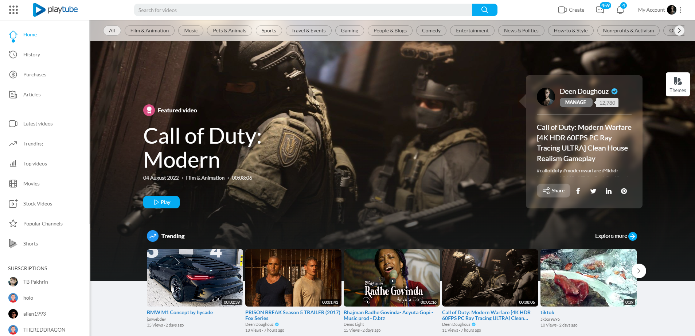
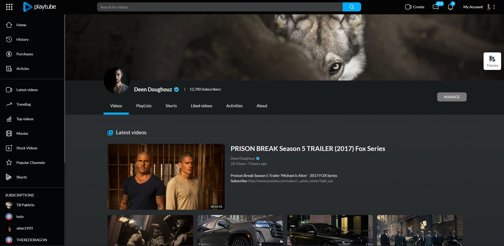
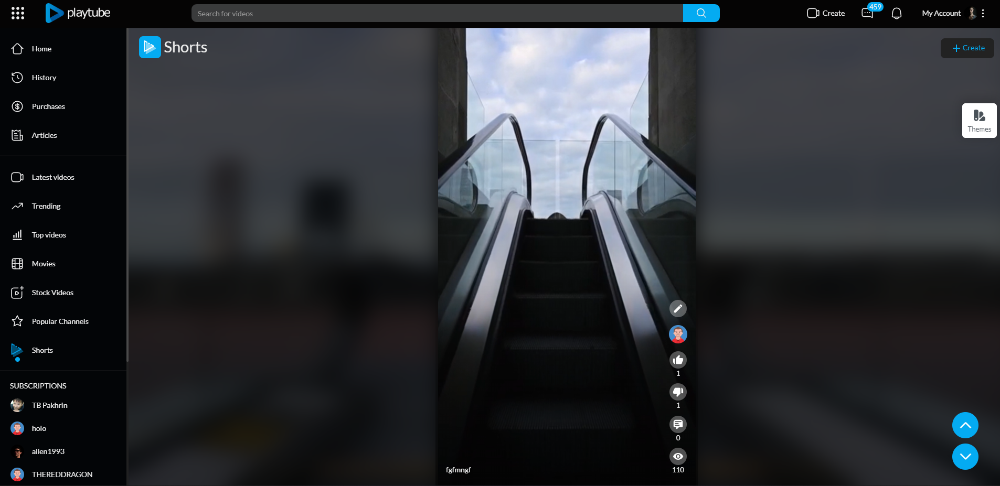
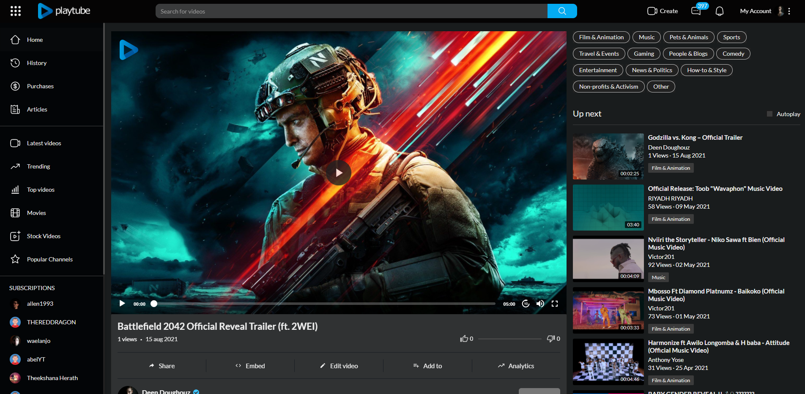

# PlayTube

PlayTube is a self-hosted PHP video CMS for running a YouTube-style video sharing and streaming site, aimed at content creators, agencies and media companies who want to host the platform themselves.

Languages: [English](readme.md) · [فارسی (Persian)](readme-fa.md) · [Kurdî (Kurdish)](readme-kurdish.md)



## Overview

PlayTube ships as a ready-to-deploy PHP application with a full admin panel, a multi-theme front end, and a versioned REST API that native mobile clients can talk to. Content is stored in MySQL and media is transcoded with FFmpeg. An optional Node.js and Socket.IO service adds real-time features on top of the core PHP application.

The application covers user channels, subscriptions, comments, playlists, live streaming, Shorts, monetisation (Pro plans, paid videos, wallet, ads and affiliates), and social login. It runs behind Apache or Nginx and scales from a single-server install to a production deployment.

Current version: v3.1.1

## Features

- Video upload, FFmpeg transcoding, and adaptive streaming playback.
- Live streaming and short-form vertical videos (Shorts).
- User channels, subscription feeds, watch history, liked and saved videos.
- Comments, posts and timeline, articles, hashtags, and notifications.
- Monetisation: Pro upgrades, paid videos, wallet and transactions, ads, and an affiliate system.
- Versioned REST API (`app_api/v1.0`) for iOS and Android clients.
- Social login and two-factor authentication.
- Payment gateways: Stripe, Braintree, Authorize.Net, PayFast, 2Checkout, SecurionPay, iyzico, QIWI, Alipay and others.
- Storage backends: local disk, FTP, or Amazon S3.
- Admin panel with dashboards, content moderation, analytics, and site configuration.
- Two bundled front-end themes: `default` and `youplay`.
- Optional Node.js and Socket.IO service for real-time updates.
- Documentation in English, Persian, and Kurdish.

## Tech stack

| Layer | Technology |
| --- | --- |
| Backend | PHP 7.1+ (MySQLi) |
| Database | MySQL (`playtube.sql` schema) |
| Media | FFmpeg, getID3 |
| Real-time | Node.js, Express, Socket.IO |
| Front end | JavaScript, HTML, CSS, theme engine |
| API | Versioned REST API for mobile apps |
| Web server | Apache (`.htaccess`) or Nginx (`nginx.conf`) |

## Requirements

- PHP 7.1 or higher
- MySQLi
- PHP extensions: GD Library, mbstring, calendar
- cURL enabled, with `allow_url_fopen`
- The `shell_exec` PHP function enabled (required for FFmpeg)
- A web server (Apache or Nginx) and a MySQL database

## Installation

1. Upload all script files to your web server root via FTP, or place them in your localhost root directory.
2. Open your browser and navigate to:

   ```text
   http://www.YOURSITE.com/install
   ```

3. Accept the Terms of Use and continue.
4. Confirm your server meets the requirements above. The installer verifies them for you.
5. Fill in the installation form:

   - Purchase Code — your Envato purchase code
   - SQL Host / Username / Password / Database — your MySQL connection details
   - Site URL — for example `https://yoursite.com`
   - Site Name, Site Title, Site E-mail (use a server email address, not Gmail or Hotmail)
   - Admin Username and Admin Password

6. Click Install and wait. Installation can take up to about five minutes.

### Nginx

Copy the contents of the bundled `nginx.conf` into your server's root `nginx.conf`, usually `/etc/nginx/nginx.conf`, then reload Nginx.

### Cron job

After installation, add the following to your server's crontab so background tasks run:

```bash
*/15 * * * * php -f {PATH_TO_SCRIPT}/cronjob.php > /dev/null 2>&1
```

Replace `{PATH_TO_SCRIPT}` with the absolute path, for example `/home/playtube/public_html`.

### Optional real-time Node.js service

```bash
cd nodejs
npm install
npm start
```

## Project structure

```text
playtube/
├── index.php             # Front controller
├── admincp.php           # Admin control panel
├── api.php               # API entry point
├── ajax.php              # AJAX endpoints
├── cronjob.php           # Scheduled background tasks
├── secure_video.php      # Secure video delivery
├── playtube.sql          # Database schema
├── nginx.conf            # Nginx configuration sample
├── admin-panel/          # Admin dashboard UI and assets
├── app_api/v1.0/         # Versioned REST API for mobile apps
├── sources/              # Page and feature modules (watch, upload, live, shorts, …)
├── assets/libs/          # Payment, storage, social and media libraries
├── themes/               # Front-end themes (default, youplay)
├── nodejs/               # Node.js and Socket.IO real-time service
├── install/              # Web installer
└── upload/               # User uploads and screenshots
```

## Screenshots

<p align="center">
  
  
  
  
  
</p>

## Contributing

Read [`CONTRIBUTING.md`](CONTRIBUTING.md) and the [Code of Conduct](CODE_OF_CONDUCT.md), then open an [issue](https://github.com/morpheusadam/PlayTube/issues) or submit a pull request. Report security issues as described in [`SECURITY.md`](SECURITY.md).

## License

Distributed under the MIT License. See [`LICENSE`](LICENSE) for details.

## Author

Morpheus Adam — web developer, PHP, Laravel, Go.

- GitHub: [morpheusadam](https://github.com/morpheusadam)
- Website: [sam.zeonic.me](https://sam.zeonic.me)
- Email: morpheusadam95@gmail.com
